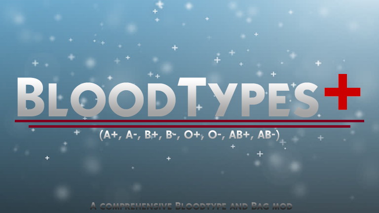

<h1 align="center">
  </img>
   
    RimWorld Blood Types and Blood Bags
   
</h1>

<h4 align="center">Community fork of AliceCecil's mod</h4>

  
  
  
  
  

This mod adds blood types, transfusion and other bonuses and mishaps related with that.

By the time you are six months old, you naturally develop antibodies against the antigens your red blood cells lack. For instance, a person with A blood type will have anti-B antibodies, and a person with B blood type will have anti-A antibodies. If you have type A blood, you cannot receive B blood because your body's anti-B antibodies will fight the B blood's B antigens.

Blood bag icon by [diannetea](https://steamcommunity.com/profiles/76561197999112252)
